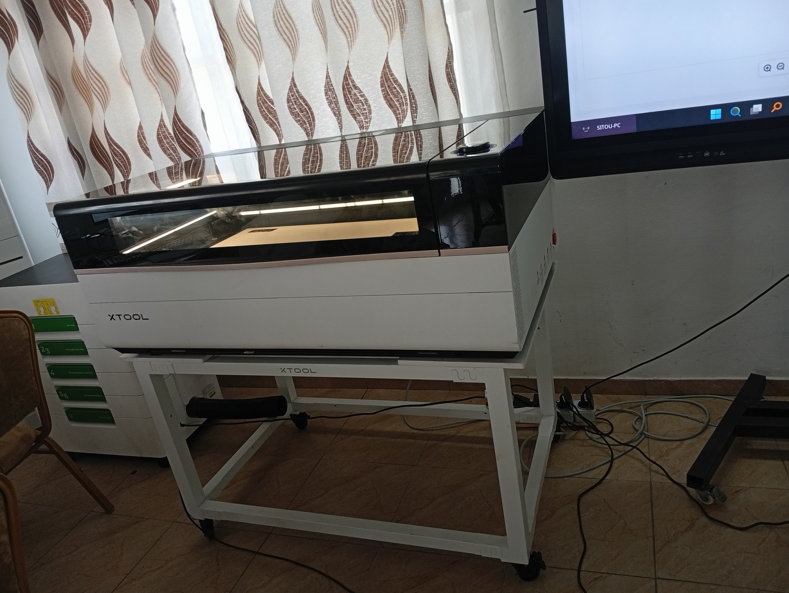
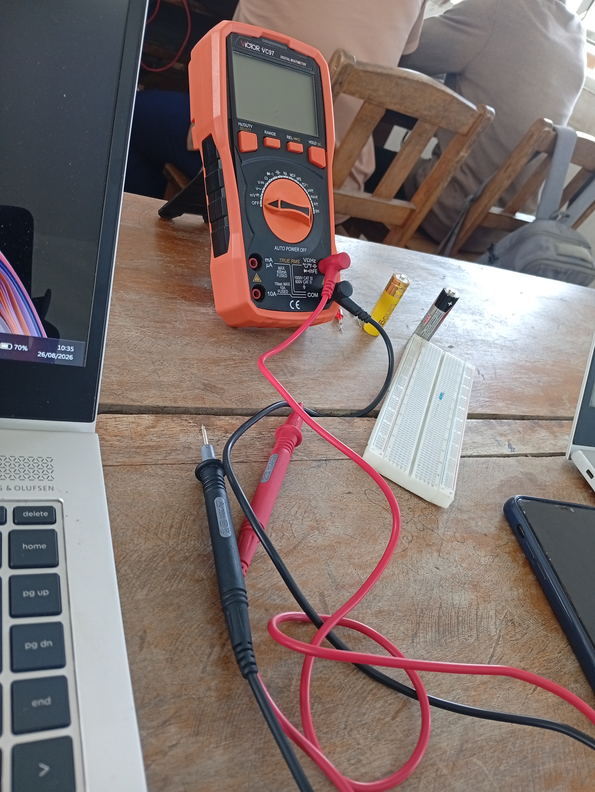

# Journal du 25 Août 2026 ( rédigé par ABISSI MALIMDA)

## Appris
- Les fondamentaux du Découpe LASER
- Grandes familles et les différentes machines utilisées à savoir CO2 avec P3, Fibre avec F2 Ultra, Diode avec M1 Ultra, UV
- Comparatif entre les machines xTool
- Sécurité des machines : les classes IEC 60825-1
- Bases de l'électronique telles que la tension, le courant, la résistance...
- Fabrication additive dont l'essentiel concerne l'historique, les grandes familles de technologies et le comparatif de technologies
- Les technologies couramment utilisées sont la FDM, SLA
- Un bref brainstorming sur le projet intégrateur final

## À faire demain
[ ] Concevoir et imprimer ma propre carte de visite à l'aide de XTool et de la machine de découpe. - Malimda