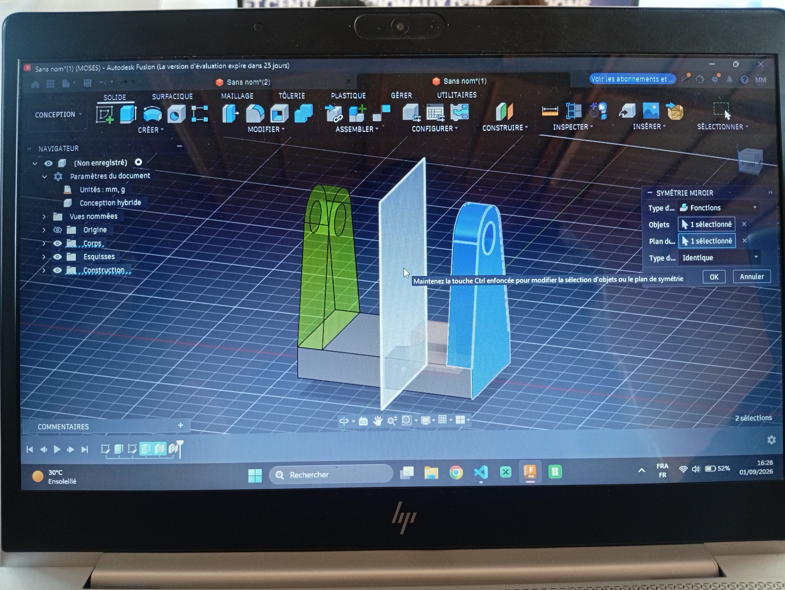

# Journal du 01 Septembre 2026 (rédigé par ABISSI MALIMDA)

## Fait aujourd'hui

- À la découverte de l'impression textile ou DTF
- Maitriser la breadboard SK10
- Immersion dans la modélisation 3D avec Fusion 360

## Appris
- Bases de l'impression textile ou DTF
- Le matériel nécéssaire à savoir imprimante DTF xTool, le film DTF, encres DTF, poudre adhésive thermofusible, four, presse à chaud et vêtement à personnaliser.
- Les étapes du DTF tels que CONCEVOIR, IMPRIMER, POUDRER, CUIRE, PRESSER et RETIRER .
- Utilité et paramétrage de l'appareil xTool Printer
- Conception et impression d'un logo personalisé
- Utilisation de la plaquette d'essai SK10 pour effectuer des montages de circuits simples
- Différence entre les montages en série et en dérivation sur une breadboard
- Les branchements des transistors BC337 NPN Et 2N2222A PNP
- Modélisation d'un objet à partir d'un plan en 2D
- Conception d'une porte clé personnalisé

## Râte puis corrigé
Les differentes étapes d'extrusion durant la conception de l'objet solide ainsi que certains petite erreurs lors du branchement des conposants électroniques.

## À faire demain
Perfectionner la conception de ma porte clé personnalisé et reviser le branchement de circuits. - Malimda

## Quelques images 

