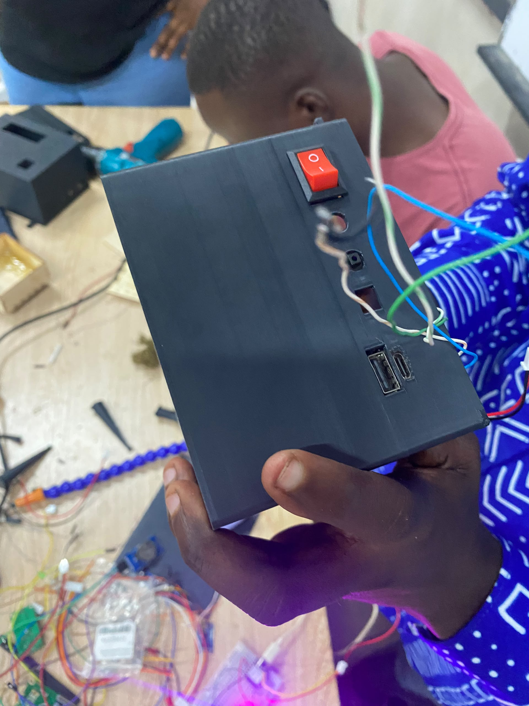
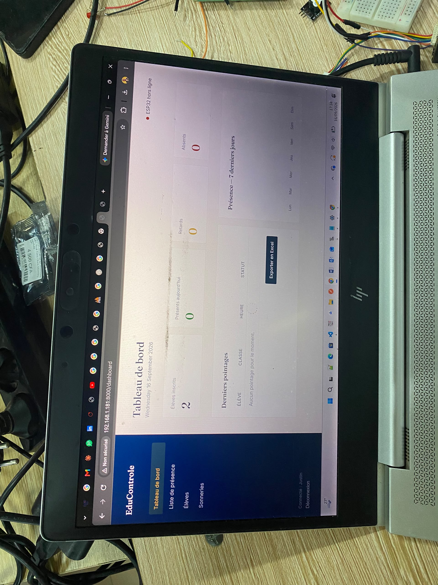
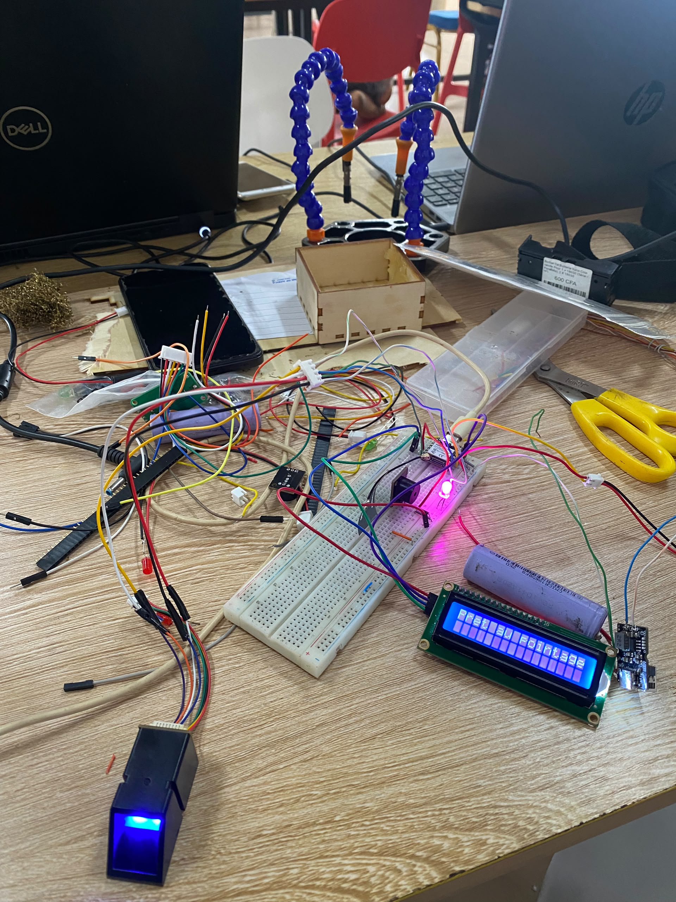
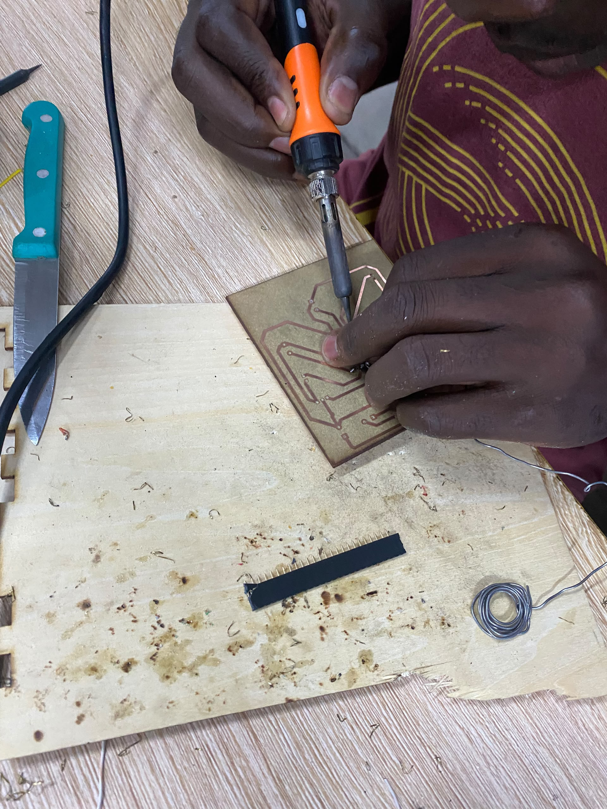
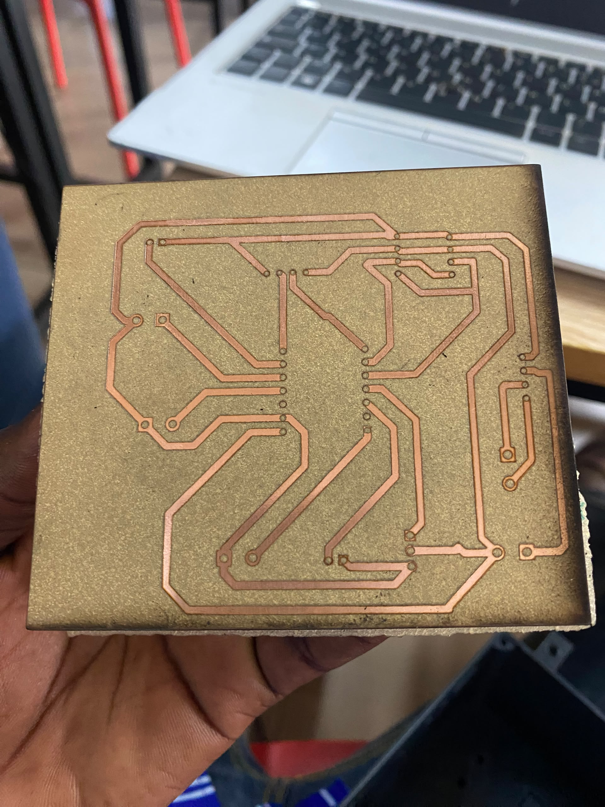

# Journal du 16 Septembre 2026(rédigé par ABISSI MALIMDA)

## Fait aujourd'hui

- Impression du boîtier  avec les corrections nécéssaires
- Impression du PCB et début des soudures
- Test d'enregistrement de quelques empreintes des membres du groupes
- Essai du code avec le capteur d'empreintes digitales AS608 et du module RTC DS3231

## Râté puis corrigé

- Traçage des pisters sur le PCB et erreur dans l'importation du fichier en format ouvrable dans xTool
- Erreur dans le calibrage des paramètres machines du F2 Ultra

## Décidé

Accélérer le processus d'exécution des tâches par chacun des membres du groupes 

## À faire demain

Finaliser les dernirs tests et passer à l'assemblage des parties dans le boîtier en de préparer le Powerpoint de la soutenance. -GROUPE 10

## Quelques images du jour

